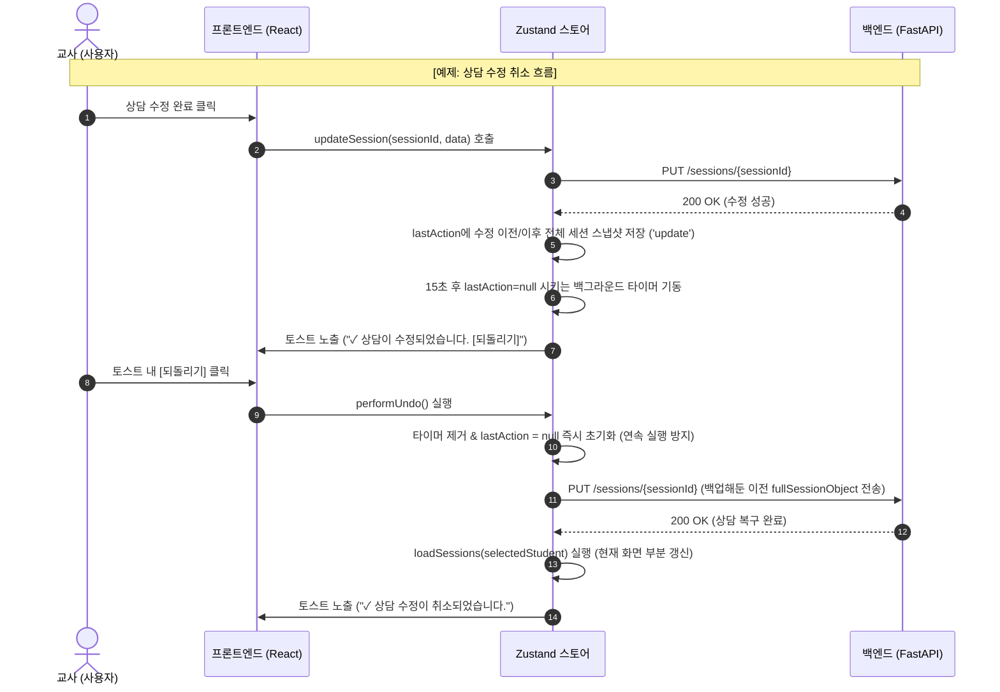

# 최근 작업 취소(Undo) 시스템 구현 계획서 (Gmail-style) - 수정본

본 문서는 사용자가 상담일지 앱에서 상담 기록을 **생성, 수정, 삭제**했을 때, 방금 수행한 최근 1건의 작업을 취소하고 이전 상태로 되돌릴 수 있는 **단일 동작 취소(Gmail-style Undo) 시스템**의 설계 및 구현 계획을 정의합니다.

---

## 1. 아키텍처 설계

전역에서 무한 히스토리 스택을 쌓는 대신, 가장 최근에 성공한 작업 1건을 저장하는 `lastAction` 버퍼를 Zustand 전역 스토어에 유지합니다.

```text
[상담 생성/수정/삭제 실행]
         │
         ▼
[성공 시 lastAction 상태 업데이트 및 15초 만료 타이머 기동]
         │
         ▼
[성공 토스트 메시지 띄움 (되돌리기 버튼 포함)]
         │
  ┌──────┴───────────────┐
  ▼                      ▼
[사용자가 토스트 X 클릭]  [되돌리기 클릭]
  │                      │
  ▼                      ▼
[토스트만 닫힘,          [Zustand 스토어의 performUndo 실행]
 Undo 기회는 15초        │
 동안 백그라운드 유지]    ▼
  │               [백엔드 API 호출로 원복]
  ▼                      │
[15초 타이머 만료]         ▼
  │               [현재 학생 세션만 부분 갱신]
  ▼                      │
[lastAction 소멸]        ▼
                  [성공 취소 토스트 안내 및 
                   lastAction = null 강제 제거]
```

---

## 2. 데이터 구조

Zustand 상태에 유지될 단일 취소 데이터(`lastAction`)의 구조입니다. 특정 필드 나열 방식 대신 **전체 세션 객체 스냅샷(Full Session Object)**을 그대로 저장하여 향후 필드 추가에 안전하게 대처합니다.

```typescript
interface UndoAction {
  type: 'create' | 'update' | 'delete';
  studentId: string;     // 대상 학생의 학번
  studentName: string;   // 대상 학생의 이름
  
  // 전체 세션 객체 스냅샷
  sessionData: any;      
}
```

---

## 3. Zustand 상태 설계

`sessionSlice.js` 또는 별도의 슬라이스에 상태와 액션을 추가합니다.

### 3-1. State
* `lastAction: UndoAction | null`: 최근 수행된 작업 정보 버퍼.
* `undoTimerId: any | null`: Undo 유효기간 제어용 타이머 식별자.

### 3-2. Actions
* `setLastAction(action: UndoAction | null)`: 최근 작업 스냅샷 저장 및 15초 카운트다운 타이머 기동 (이전 타이머가 있다면 초기화).
* `performUndo()`: `lastAction`을 해석하여 백엔드 API를 호출하고 원복을 실행하는 액션. 실행 즉시 `lastAction`을 `null`로 강제 초기화하여 연속 실행을 방지합니다.

---

## 4. UI 및 UX 설계

### 4-1. 토스트 알림 연동 및 토스트 닫기 동작 분리
* 토스트 내 `[되돌리기]` 액션 버튼을 제공합니다.
* 사용자가 토스트의 우측 `X` 버튼을 눌러 토스트를 닫아도 **Zustand 스토어 내부의 `lastAction`은 지우지 않고**, 15초 타이머가 만료될 때까지 백그라운드에서 취소 권한을 유지시킵니다.
* **학생 전환 시에도 `lastAction`을 파괴하지 않고**, 15초 유효 기간이 끝날 때까지 취소 기능을 제공하여 사용자가 화면 전환 실수 후에도 되돌리기를 수행할 수 있도록 합니다.

### 4-2. 토스트 문구 개선
취소 성공 시 구체적인 상태를 인지할 수 있도록 직관적인 메시지를 노출합니다.
* **생성 취소 시**: `✓ 상담 저장이 취소되었습니다.`
* **수정 취소 시**: `✓ 상담 수정이 취소되었습니다.`
* **삭제 취소 시**: `✓ 삭제된 상담이 복구되었습니다.`

---

## 5. Undo 흐름도



---

## 6. 수정 대상 파일 목록

### 6-1. Store Slices
* [sessionSlice.js](file:///c:/Coding/Projects/School/CounselingLog_Electron/frontend/src/store/slices/sessionSlice.js):
  - `lastAction` 및 `undoTimerId` 상태 정의.
  - `addSession`, `updateSession`, `deleteSession` 실행 전/후 전체 세션 스냅샷을 구성하여 `setLastAction` 호출.
  - `performUndo` 비동기 액션 구현.
  - Undo 성공 시 `initialize()` 전체 호출 대신 `loadSessions(selectedStudent)`를 호출하여 부분 화면 및 목록만 갱신.

---

## 7. 단계별 구현 계획

### 1단계: Zustand 스토어 스냅샷 버퍼 구현
1. `sessionSlice.js`에 `lastAction` 및 `undoTimerId` 상태를 구현합니다.
2. `setLastAction`에서 새로운 작업이 들어올 경우, 기존 `undoTimerId` 타이머를 정지(`clearTimeout`)하고 15초 뒤 `lastAction = null`로 초기화하는 새로운 타이머를 세팅하도록 합니다.

### 2단계: 개별 CRUD 액션에 스냅샷 연동
1. **생성(Create)**: 상담 추가 API가 완료되어 할당받은 신규 UUID 및 전체 세션 데이터 정보를 `lastAction`에 저장합니다.
2. **수정(Update)**: 수정하기 전, `sessions` 목록에서 기존의 원본 세션 오브젝트 전체를 복사하여 `lastAction`에 저장합니다.
3. **삭제(Delete)**: 삭제를 누르기 전, `sessions` 목록에 있는 해당 세션 오브젝트 전체를 복사하여 `lastAction`에 저장합니다.

### 3단계: `performUndo` 백엔드 연동 액션 구현
1. `performUndo`가 호출되면 우선 백그라운드 타이머를 제거하고 `lastAction` 상태를 즉시 백업한 후 스토어 상태는 `null`로 밀어 연속 클릭을 방지합니다.
2. `lastAction.type`에 따라 다르게 복구 연동합니다.
   * `create`: `deleteSession(sessionId)`을 실행하여 새로 등록되었던 행을 지웁니다.
   * `update`: 기존 `updateSession` API에 백업해둔 이전 스냅샷의 전체 필드를 담아 덮어씌웁니다.
   * `delete`: 백엔드의 `addSession` API에 삭제 이전 전체 스냅샷 필드를 실어서 재생성합니다.
3. 원복 후에는 전체 데이터베이스 동기화인 `initialize()` 대신 **`loadSessions(selectedStudent)`**와 **`getTodayStats()`**만 선택적으로 호출하여 가볍게 부분 갱신합니다.

### 4단계: 토스트 UX 연동
1. 토스트의 알림 제거(`removeToast` 또는 닫기 버튼) 액션과 `lastAction` 상태 수명을 독립적으로 제어합니다.
2. 취소 성공 시 개선된 구체적 문구(`✓ 상담 저장이 취소되었습니다.`, `✓ 상담 수정이 취소되었습니다.`, `✓ 삭제된 상담이 복구되었습니다.`)를 표시하도록 설정합니다.
